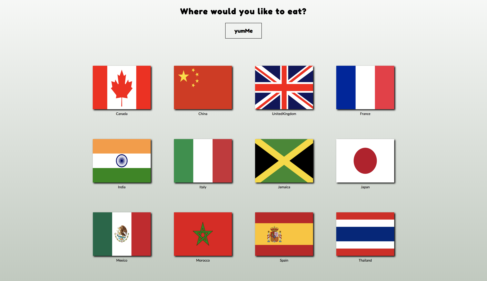
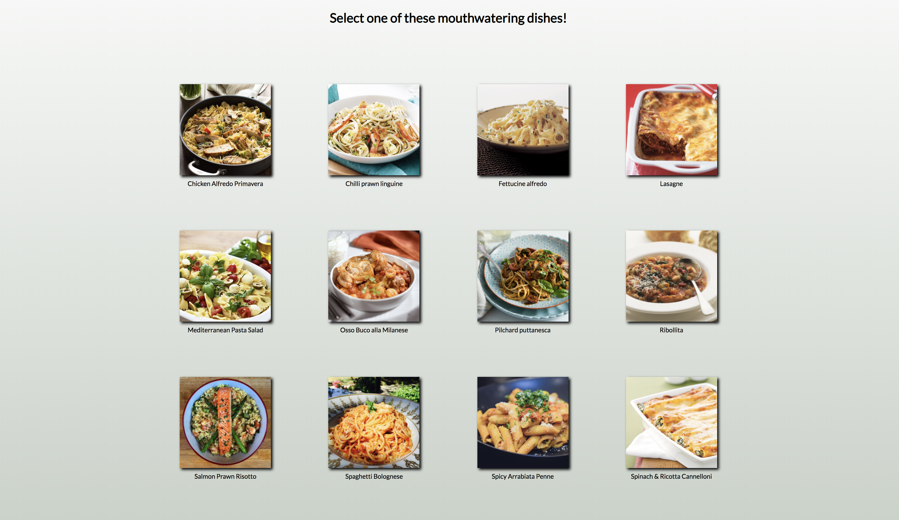
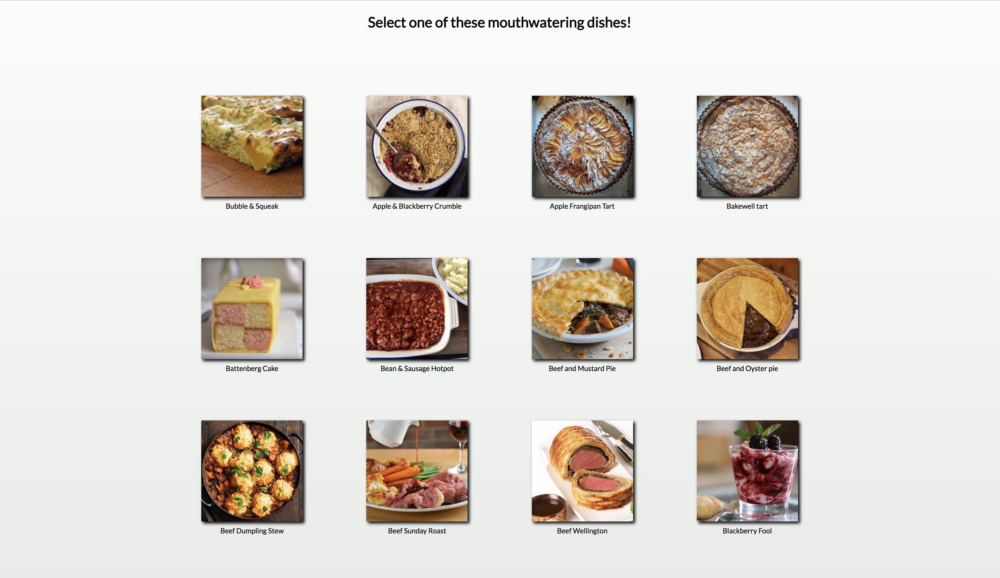
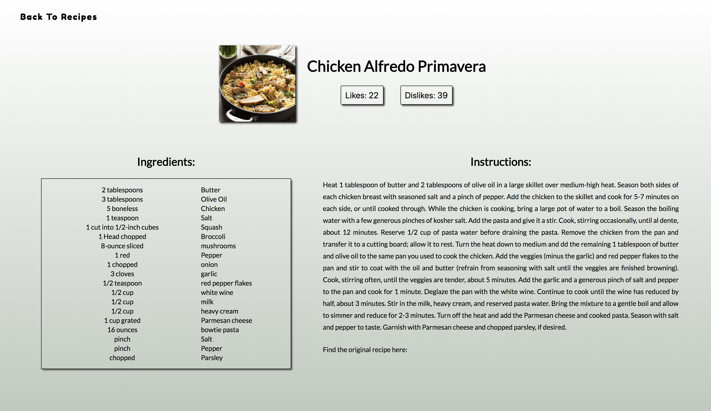
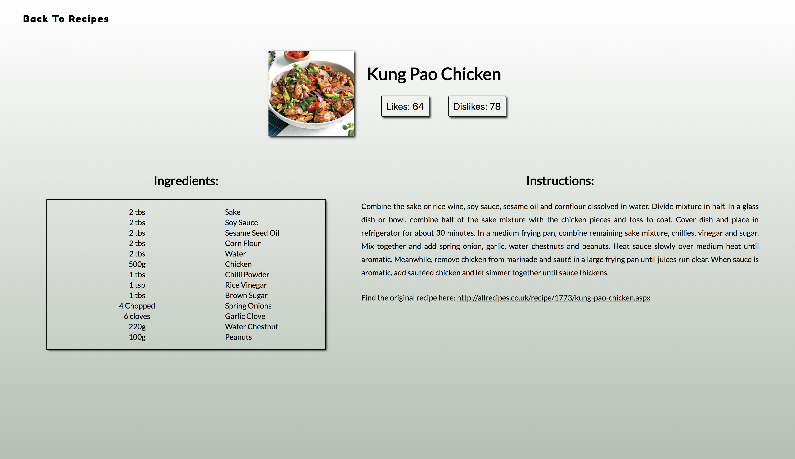
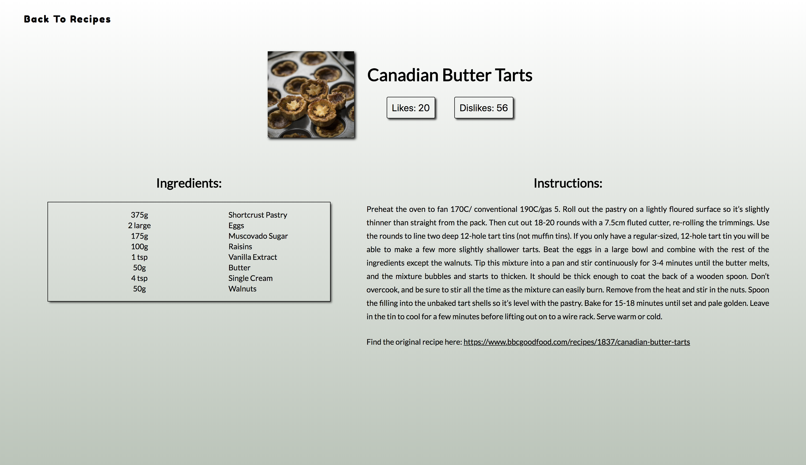

# yumWorld React App

## What Is This Project About
This website is a food app that uses React and API calls, to render meal instructions to the user based on the selected country and meal.

## Technologies used
* HTML
* CSS / Flexbox
* Vanilla JavaScript
* React
* React Router
* NPM

## Site Walkthrough

Here the user can select what recipe's they would like to retieve by clicking on a specified country flag image.

    </img>

 

Once the user picks a country they will be navigated to a page with a list of meals from that country. 

    </img>

    </img>

 

    </img>

After user selects a recipe they will be navigated to a page with a list of ingrediants and meal prep instructions.

    </img>

 

    </img>

 

    </img>

## Code Walkthrough / Featues

### Built By April Copes, Steven Taesung Kim, Clare Barton, and Lauren Wilkerson
