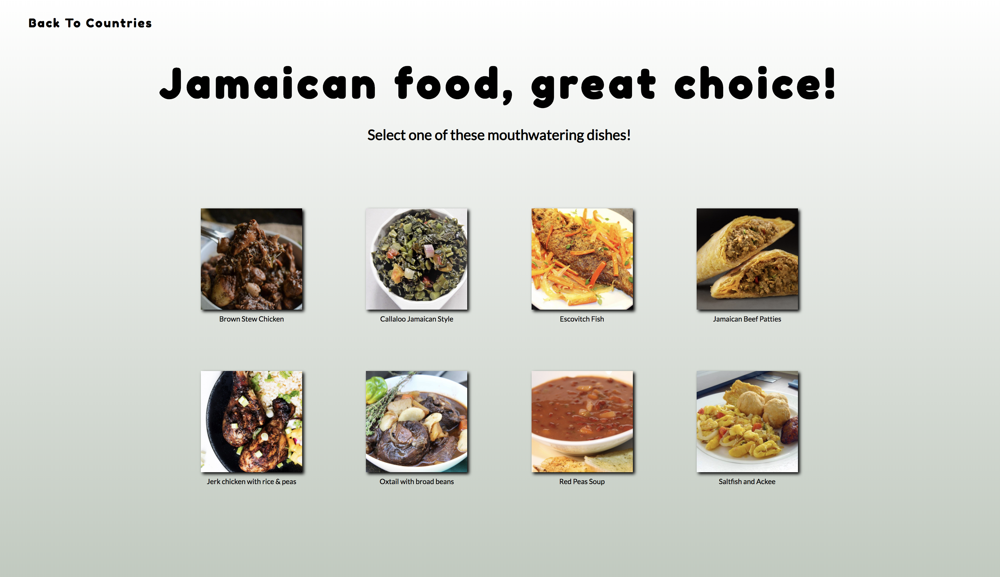

# yumWorld React App

## What Is This Project About
This website is a food app that uses React and API calls, to render meal instructions to the user based on the selected country and meal.

## Technologies used
* HTML
* CSS / Flexbox
* Vanilla JavaScript
* React
* React Router
* NPM

## Site Walkthrough
<p>Here the user can select what recipe's they would like to retieve by clicking on a specified country flag image.</p>
<p align='center'>
    </img>
</p>
<br>

<p>Once the user picks a country they will be navigated to a page with a list of meals from that country. </p>
<p align='center'>
    </img>
</p>
<p align='center'>
    </img>
</p>
<br>
<p align='center'>
    </img>
</p>

<p>After user selects a recipe they will be navigated to a page with a list of ingrediants and meal prep instructions.</p>
<p align='center'>
    </img>
</p>
<br>
<p align='center'>
    </img>
</p>
<br>
<p align='center'>
    </img>
</p>

## Code Walkthrough / Featues


### Landing Page, Recipe Page, and Ingredients Page Features
<p>The landing page is a view of country flags for user to click.</p>
<br>
<br>

<p>The images have a scale and box shadow transition on hover</p>

```

```

<p>When the image is clicked we pass an object as props down to our flag country component</p>

```

```

<p>Once the user picks a meal they are then routed using Link from React router with access to props from our parent compoment</p>

```

```

### API Features
<p>We do a fectch request and convert our response to JSON and drill into our object to set out state to a property on our retrieved object.</p>

<p></p>

```

```

<p></p>

```

```

<p></p>

```

```

### Counters / Randomized Feature
<p></p>

<p></p>

```

```

<p></p>

```
    
```

### Challenges and What I Learned

<p></p>

```
    
```

### Built By:
#### April Copes, Steven Taesung Kim, Clare Barton, and Lauren Wilkerson
